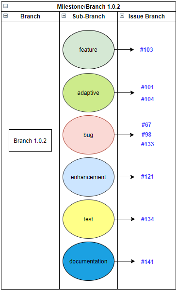

# CONTRIBUTING

HappyTree API has a contribution organization in a very simple way,
without bureaucracy. All of this in order to further encourage the
act of contributing by third parties.

Basically, there are only two types of contribution: the contribution
by **Issues** and the contribution by **Coding**. Obviously, every
collaborator can contribute both simultaneously.

## Code of Conduct

Before you start, stick to our [Code of Conduct](./CODE_OF_CONDUCT.md)
to help us keep open and inclusive.

## Contributing

Every contribution is inserted within the context of *Milestone*.
Each *Milestone* represents a version number (example: [1.0.0],
[1.0.1], [1.0.2], etc.) of the API being developed within a period of
time and each contribution is made on the current *Milestone*. With
this in mind, below are the types of contributions.

### Issues

Any collaborator can create new **Issues**. To do this, just put in
the title the prefix corresponding to the current *Milestone*
(version), for example: **[1.0.2] - Print Hello World**. It is very
important that this prefix (**[1.0.2] -**) be placed.

In addition, it is only necessary to define the type of **Issue** to
be created. Each type is represented by a *Github Label*. Below are
the labels that will define what each **Issue** proposes:

| Label  | Description  |
|---|---|
| adaptive  | Request/Feature change  |
| bug  | Something isn't working  |
| documentation  | Official documents and .md Files  |
| enhancement  | Improvements and refactoring  |
| feature  | New functionality/feature  |
| important  | Notify for very urgent or important issue  |
| invalid  | This doesn't seem right  |
| question  | Further information is requested  |
| suggestion  | Give us any suggestion about functionality or anything else  |
| test  | Testing issue  |

Whatever the type of **Issue**, the collaborator may feel free to
organize ideas as he wishes, with the exception of the
**Bug-type Issue**. This **Issue** deserves special treatment in its
description. Therefore, it facilitates the work of correcting bugs,
if an **Issue**, in its description, has the following topics in the
same order:

1. What was done;
	* Describe in an objective and summarized manner what has been
	done.
2. What happened;
	* Describe in an objective and summarized way the result of what
	happened.
3. What was expected to happen;
	* Describe in an objective and summarized way the result that was
	expected.
4. Steps.
	* List and detail the step-by-step of what was done, if
	preferable, with some screenshots.
	
### Coding

For **Coding**, the process remains simple, but a little more complex
than the contribution by **Issues**. In fact, this type of
contribution also requires the collaborator pay attention to the
respective **Issue** to which he is developing. In addition to the
**Issue**, the collaborator needs to stick to the current version of
the API, which corresponds to the development of the current
*Milestone*.	

When *Forking* the project, the collaborator will have access to the
*Branch* of the current version that will be used to incorporate his
development (the collaborator's developments are always based on the
*Branch* of the current version - *Milestone*). Just below the main
*Branch* (*master branch*), there will be several *Branches* that
correspond to their respective *Milestones*, and following the same
structure, below the *Branch* which corresponds to its respective
*Milestone*, there will be several *Sub-Branches* that correspond to
the respective Labels indicated in the **Issue** to which the
collaborator is working. For example, if the collaborator is solving
a *Bug*, then the collaborator has to submit his work within the
*Sub-Branch Bug*. This submitted work represents another *Branch*
created by the collaborator himself that will be used to perform the
*commit*. This *Branch*, created by the collaborator, must indicate
exactly the **Issue** number that he is working on.

The following image is a simple example when the collaborator wishes
to contribute within Branch/Milestone/Version 1.0.2:

  
  </a>

The numbers indicated in the column on the right represent the
*Branches* created by the collaborator that will be used to commit.
Each of these *Branches* created by the collaborator will be inserted
within their respective *Sub-Branch* which indicates what type of
development has been done. It is recommended that the *Issue Branch*
indicates which *Milestone* it belongs. A good example of a
*Issue Branch* pattern is something like
**[1.0.2-103] - Short Description**, which the *1.0.2* corresponds to
the current *Milestone* and *103* indicates the *Issue*. Through the
labels, it is possible to identifier which *Sub-Branch* it will
refer in the *Pull Request* phase.

Then, it is enough that the collaborator makes the *Pull Request* of
the *Branch* created by himself for the HappyTree repository. If it
is accepted, the collaborator's work will be incorporated within the
*Sub-Branch* and will be available already within *Milestone*, which
can be released already in the current version of the HappyTree API.
However, when it comes to new features, it can be reallocated for
future releases, a question that is decided soon after analysis.

For a code contribution to be successful, it has to pass the
following steps:

1. **Coding Standards;**
2. **Unity Tests;**
3. **Sonar Analysis.**

## See Before Contributing

* [Required/recommended technologies](../README.md#techs)
* [HappyTree API coding standards](./coding/CODING_STANDARDS.md)
* [Writing tests](./coding/WRITING_TESTS.md)
