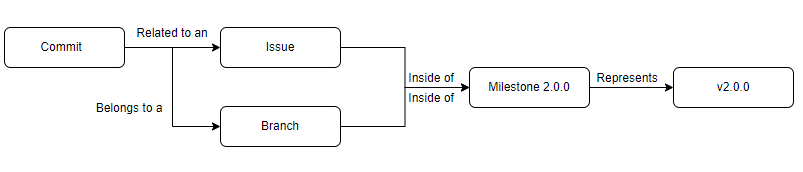
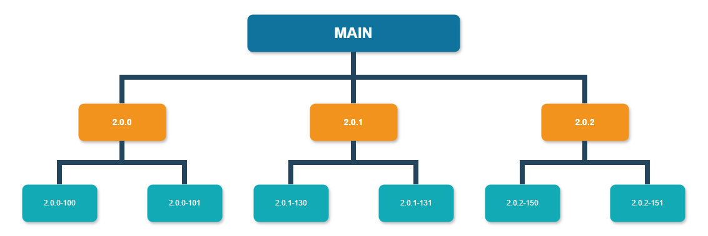

# CONTRIBUTING

HappyTree API has a contribution organization in a very simple way, without
bureaucracy. All of this in order to further encourage the act of contributing
by third parties.

Basically, you as a person who wants to contribute, you just need to fork the
project and work over the actual version of the project, that version which is
specified in every reported issue, through the milestone section.

## Code of Conduct

Before you start, stick to our [Code of Conduct](./CODE_OF_CONDUCT.md) to help
us keep open and inclusive.

## Workflow

Every contribution is inserted within the **Issue** context which can be reported
by anyone and this **Issue** is related with the actual **Milestone** of the
project. Each **Milestone** represents a version number (the current
**Milestone** is 2.0.0), the official API version being developed at the moment.
Also, for each **Milestone**, there always will exist its respective **Branch**,
in this case named **2.0.0**, and **every development must be done under this
branch, know as version branch.** So, there always will have a connection among
**Issue**, **Milestone** and **Branch** and this link is identified by the
current version of the API being developed at the moment.

### Milestone

Each milestone represents a version of the project and have an estimated date to
be concluded. The project can have the same number of milestone as the project
versions, being currently the version **2.0.0**.

The milestone is a concept that is used only for internal purpose, the external
collaborators can not handle it.

### Issues

Any collaborator can create new issues. To do this, just put in the title, the
prefix corresponding to the current *Milestone* version, for example:
**[2.0.0] - Print Hello World**. It is very important that this prefix
(**[2.0.0] -**) be placed.

In addition, it is only necessary to define the type of **Issue** to be created.
Each type is represented by a *Github Label*. Below are the labels that will
define what each issue proposes:

| Label  | Description  |
|---|---|
| type: adaptive  | Request/Feature change issue  |
| type: bug  | Bug found  |
| type: documentation  | Issue for API doc and .md Files  |
| type: enhancement  | Issue for improvements and refactoring  |
| type: feature  | Issue for new functionality/feature  |
| type: question  | I've a question  |
| type: suggestion  | Give us any suggestion about everything  |
| type: test  | Issue for unit test  |
| type: urgent-bug  | Notification for high priority bug  |

Whatever the type of the issue, the collaborator may feel free to organize ideas
as he wishes, with the exceptions of the **type: bug** and **type: urgent-bug**
issues. Those types deserve special treatment in its description, because it
facilitates the work of correcting bugs if an issue, in its description, has
the following topics in this order:

1. What was done;
	* Describe in an objective and summarized manner what has been done.
2. What happened;
	* Describe in an objective and summarized way the result of what happened.
3. What was expected to happen;
	* Describe in an objective and summarized way the result that was expected.
4. Steps.
	* List and detail the step-by-step of what was done, if	preferable, with
	some screenshots.
	

When a collaborator publish a new issue, it doesn't mean that the issue will be
treated immediately, as this issue will receive a feedback by the HappyTree Team,
represented by black labels and these labels can be:

| status: waiting-for-triage  | Issue which was not seen yet  |
| status: accepted  | Accepted issue  |
| status: declined  | Declined issue  |
| status: declined-duplicate  | Declined. Duplicate issue  |

After the collaborator have your issue been accepted, for sure that this issue
will be present in the next release. So, the collaborator has the possibility of
tracking your issue through the white labels information provided by HappyTree
Team over the course of time:

| phase: backlog  | Issue that is in backlog phase  |
| phase: in-progress  | In progress issue  |
| phase: testing  | Issue in testing phase  |
| phase: done  | Issue that is concluded and will be in next release  |

### Branches

HappyTree API strategy of handling development branches consists in work based
on version, in other words, a version number drives the link among **Issues**,
**Branches** and **Milestone**.

  
  </a>

This strategy of workflow is know as **Release Flow**, where, from the **main**
branch, a respective branch for each release is created, in this case, creating
the **2.0.0** branch under **main** branch.

  
  </a>

In this way, new features and fixes are made in dedicated branches and merged
into **2.0.0** branch first before going to **master/main**, ensuring a good
separation between stable and development code.

Knowing the current version which the work will be done, through the milestone,
there will have only a branch below the **main**, and its name will represent
the current version. **All developments, made by HappyTree Team and external
collaborators must be child of this branch.** In a example of the v2.0.0, the
**main** branch will have only one branch child called **2.0.0**.

Below of version branch, **2.0.0**, the collaborator creates his branch with no
restriction, but as a recommendation, it will be nice whether the created branch
follows the format: **2.0.0-issueId**, where *issueId* is the GitHub Issue ID
reported by any user. For example, if there is an Issue #100, the branch name
would be **2.0.0-100**.

## Coding

You as a developer who want to contribute, you must read, in the specified
order, the following documents before start:

1. [HappyTree API Coding Standards](./coding/CODING_STANDARDS.md)
2. [Writing Tests](./coding/WRITING_TESTS.md)
3. [Checklist](./coding/CHECKLIST.md)