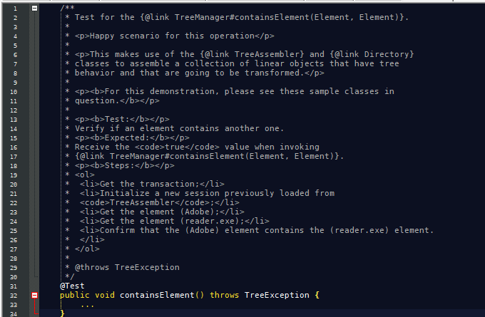

# Writing Tests

The HappyTree API has a well-defined structure of unit tests for each
method and each interface made available to the API client. In this
context, JUnit is adopted for unit testing.

In the first part, will be showed up the unit tests structure. Lastly
this document will introduce how the collaborators can help us, by
determining standards/recommendations of writing tests.

## The unit tests structure

Currently, the Happy Tree API provides to the API client, four
interfaces for handling trees. Each interface contains a set of
services (methods) that helps the API Client to handle trees. Those
interfaces are:

* [Element](../../src/main/java/com/miuey/happytree/Element.java)
* [TreeManager](../../src/main/java/com/miuey/happytree/TreeManager.java)
* [TreeTransaction](../../src/main/java/com/miuey/happytree/TreeTransaction.java)
* [TreeSession](../../src/main/java/com/miuey/happytree/TreeSession.java)

With this in mind, the unit tests structure are based in two types of
tests:

### Demo tests

They are customized tests, free of any rule. Any collaborator can
perform any type of tests for the HappyTree API here. The test
classes are localized in: [demo](../../src/test/java/com/miuey/happytree/demo).

Already, there are **model** and **util** sub-packages, for better
organization.

### API client interfaces tests

These tests are fundamentals for each available service provided by
their respective interfaces. So, each interface are represented by
a package, and each package can contain:

* The happy scenario tests (mandatory);
* The alternative scenario tests (optional);
* The error scenario tests (optional);
* The suited test class to run whole the tests from a package which
 represents an interface (mandatory).

#### Nomenclature

For each interface, it is adopted the following nomenclature, for
example: **[TreeManager]**

**[Interface Name] + [Scenario Test] + [Test Suffix]** (Except for the happy scenario)

For happy scenario, the **[Scenario Test]** is omitted.

* **Happy Scenario:** *TreeManagerTest*
* **Alternative Scenario:** *TreeManagerAlternativeTest*
* **Error Scenario:** *TreeManagerErrorTest*
* **Suited Test Class:** *TreeManagerSuiteTest*

### Main Test Class

The main test class of the HappyTree API is in:
[HappyTreeTest](../../src/test/java/com/miuey/happytree/HappyTreeTest.java)
in the root level of the test package.

Just as [HappyTree](../../src/main/java/com/miuey/happytree/core/HappyTree.java)
represents an entry class for the API, **HappyTreeTest** represents
an entry test class to perform all unit tests of the HappyTree API.
It seems like a *Master Suited Test Class*. Every new suited test
class has to be added to the **HappyTreeTest**.

```
HappyTreeTest -> TreeManagerSuiteTest -> TreeManagerTest
                                      -> TreeManagerAlternativeTest
                                      -> TreeManagerErrorTest
```

## Standards

Before starting, the most important recommendation is below:

> Each interface (mentioned above) method **must** have at least one
test in the happy scenario.

Following are other recommendations:

* If your test is related to an interface of which the API client is
 integrated, your test must be located within the respective package
 to which the interface in question is represented.
* Implement your test and place it within the class to which the type
 of scenario the test indicates.
* It is highly recommended that the name of the test method matches
 something close to the method name of the interface to which the
 test refers. If, in addition, it is an error or alternative test, it
 would be appropriate to concatenate with "_" plus the description of
 the situation:
 	* e.g: <code>public void foo_nullArgument()</code>.
* It is highly recommended to write comments, compatible with the
 **Javadoc** convention, and define the following criteria within the
 comments:
 	* The interface method to which the test refers;
 	* A quick description of the test objective;
 	* A quick description of what is expected from the test;
 	* The enumerated steps of what the test does.
 	
### Example

<p align="center">
  
  </a>
</p>

* It is not recommended to change tests already implemented.
* If your test is just a **demo**, it should be located in the demo
package.

## Questions

Any questions regarding testing, create an **Issue** with the
*question* and *test* labels, or contact the support.

