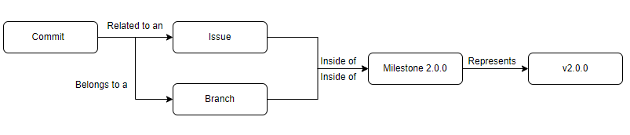
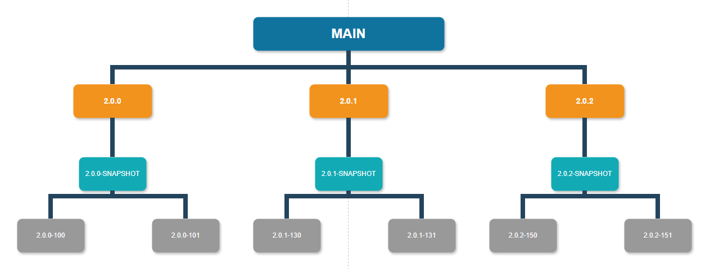

<p align="center">
  <a href="https://happytreeapi.vercel.app/" target="_blank" >
	
  </a>
</p>

# Contributing to the HappyTree API

The HappyTree API has a very simple contribution organization, with minimal
bureaucracy. This approach aims to further encourage contributions from third
parties.

If you want to contribute, you just need to fork the project and work on the
current version of the project, which is specified in every reported issue
through the milestone section.

Before you start, please adhere to our
[Code of Conduct](./.github/CODE_OF_CONDUCT.md) to help us maintain an open and
inclusive environment.

## Table of Contents

- [Branches & Issues & Milestones](#branches--issues--milestones)
  - [Milestones](#milestones)
  - [Issues](#issues)
  - [Branches](#branches)
  - [Workflow](#workflow)
- [Code Style](#code-style)
  - [Exposure](#exposure)
  - [Packages](#packages)
    - [HappyTree Package (Root)](#happytree-package-root)
      - [When to code?](#when-to-code)
    - [Annotation Package](#annotation-package)
      - [When to code?](#when-to-code-1)
    - [Exception Package](#exception-package)
      - [When to code?](#when-to-code-2)
    - [Core Package](#core-package)
      - [When to code?](#when-to-code-3)
    - [ATP Package](#atp-package)
      - [When to code?](#when-to-code-4)
  - [Encoding](#encoding)
  - [Naming Conventions](#naming-conventions)
    - [Classes/Interfaces](#classesinterfaces)
    - [Methods](#methods)
    - [Variables](#variables)
    - [Constants](#constants)
  - [Indentation](#indentation)
  - [Layout](#layout)
    - [Brackets](#brackets)
    - [Parentheses](#parentheses)
    - [Braces](#braces)
    - [Commenting](#commenting)
    - [Edge margin](#edge-margin)
- [Project information](#project-information)
  - [Requirements](#requirements)
  - [Dependencies](#dependencies)
  - [Code structure](#code-structure)
  - [Build](#build)
- [Unit Tests](#unit-tests)
  - [The unit tests structure](#the-unit-tests-structure)
    - [Demo tests](#demo-tests)
    - [API client interfaces tests](#api-client-interfaces-tests)
      - [Nomenclature](#nomenclature)
    - [Main Test Class](#main-test-class)
  - [Standards](#standards)
    - [Example](#example)
  - [Questions](#questions)

## Branches & Issues & Milestones

Every contribution is inserted within the **Issue** context which can be
reported by anyone and this **Issue** is associated with the actual
**Milestone** of the project. Each **Milestone** represents a version number
(the current **Milestone** is 2.0.0), the official API version being developed
at the moment.

Also, for each **Milestone**, there will always be its respective **Branch**,
in this case named **2.0.0**, and **every development must be done under this
branch, known as the version branch.** So, there will always be a connection
among **Issue**, **Milestone** and **Branch** and this link is identified by the
current version of the API being developed at the moment.

### Milestones

Each milestone represents a version of the project and has an estimated date to
be concluded. The project can have the same number of milestones as the project
versions, currently being at version **2.0.0**.

The milestone is a concept used only for internal purposes; external
collaborators cannot manage it.

### Issues

Any collaborator can create new issues. There are two ways of creating new
issues:
  - By using a template;
  - By creating an empty issue.

When the collaborator pushes the button to create a new issue, they will be
directed to a page where they can specify the issue type through a template or
simply create a new empty issue.

By selecting a template, all required inputs will be automatically generated
for the collaborator to fill in, so there are no concerns in this case.

Another option occurs when the collaborator decides to create an empty issue
without using templates. To do this, the collaborator must follow some rules
for better comprehension and organization of ideas. In the title, simply add
the prefix corresponding to the current *Milestone* version, for example:
**[2.0.0] - Print Hello World**. It is very important that this prefix
(**[2.0.0] -**) is included.

In addition, it is only necessary to define the type of **Issue** to be created.
Each type is represented by a *GitHub Label*. Below are the labels that define
what each issue represents:

| Label  | Description  |
|---|---|
| type: adaptive  | Request/feature change issue  |
| type: bug  | Bug found  |
| type: documentation  | Issue for API documentation and .md files  |
| type: enhancement  | Issue for improvements and refactoring  |
| type: feature  | Issue for new functionality/feature  |
| type: question  | I have a question  |
| type: suggestion  | Suggestion about any topic  |
| type: test  | Issue for unit tests  |
| type: urgent-bug  | Notification for a high-priority bug  |

Regardless of the issue type, the collaborator is free to organize their ideas
as they wish, with the exception of **type: bug** and **type: urgent-bug**
issues. These types require special treatment in their descriptions, as it
facilitates the bug-fixing process when an issue includes the following topics,
in this order:

1. What was done;
	* Describe in an objective and summarized manner what was done.
2. What happened;
	* Describe in an objective and summarized way what occurred.
3. What was expected to happen;
	* Describe in an objective and summarized way the expected result.
4. Steps.
	* List and detail the step-by-step actions that were performed, preferably
	with screenshots.

When a collaborator publishes a new issue, it does not mean that the issue will
be addressed immediately, as it will first receive feedback from the HappyTree
Team, represented by black labels. These labels can be:

| Label  | Description  |
|---|---|
| status: waiting-for-triage  | Issue that has not been reviewed yet  |
| status: accepted  | Accepted issue  |
| status: declined  | Declined issue  |
| status: declined-duplicate  | Declined due to duplication  |

After the collaborator has their issue accepted, the issue will be included in
the next release. The collaborator can then track the issue through the white
labels provided by the HappyTree Team over time:

| Label  | Description  |
|---|---|
| phase: backlog  | Issue in the backlog phase  |
| phase: in-progress  | Issue in progress  |
| phase: testing  | Issue in testing phase  |
| phase: done  | Issue completed and scheduled for the next release  |

### Branches

The HappyTree API strategy for handling development branches is based on
versions. In other words, a version number drives the relationship among
**Issues**, **Branches**, and **Milestone**.

<p align="center">
  
  </a>
</p>

This workflow strategy is known as **Release Flow**, where, from the **main**
branch, a dedicated branch is created for each release. For example, the
**2.0.0** branch is created under the **main** branch.

In this approach, new features and fixes are developed in dedicated branches
and merged first into the **2.0.0** branch before being merged into **main**,
ensuring a clear separation between stable and development code.

<b>While work is in progress on a specific version, all commits must be made
under the corresponding snapshot version branch. In the example of v2.0.0, the
branch name would be **2.0.0-SNAPSHOT**.</b> 

Knowing the current version being developed, as defined by the milestone, there
will be only one branch directly below **main**, and its name will represent
the current version. **All development, performed by the HappyTree Team and
external collaborators, must be based on this snapshot branch.** In the example
of v2.0.0, the **main** branch will have only one child branch called **2.0.0**,
and below this branch there will be only one branch called
**2.0.0-SNAPSHOT**.

Below the snapshot branch, **2.0.0-SNAPSHOT**, the collaborator may create their
own branch without restriction. However, as a recommendation, it is preferred
that the created branch follows the format: **2.0.0-issueId**, where *issueId*
is the GitHub Issue ID reported by any user. For example, if there is an Issue
#100, the branch name would be **2.0.0-100**.

<p align="center">
  
  </a>
</p>

### Workflow

The user who wishes to contribute follows a workflow partially described in
the previous sections. The workflow consists of creating or working on an
issue that belongs to a version represented by a milestone, and whose commits
are made on a branch that is nested within another branch representing that
version.

The following workflow consists of:
1. The user who wishes to contribute creates a new issue or opens an existing
issue;
2. The user views or associates the current milestone (version) being
developed;
3. If the user created a new issue, they must wait for a response confirming
whether the issue was accepted;
4. If the issue is accepted, the user forks the code;
5. The user creates a branch from the current version branch. For example, for
the v2.0.0 milestone and issue ID 100, the user creates a branch named
**2.0.0-100**;
6. The user submits a pull request to the version branch;
7. If the user's pull request is accepted, they can track their changes through
the white label feedback, indicating whether the issue has received the *done*
label.

## Code Style

The HappyTree API is characterized by being a simple and flexible project, in
which collaborators have some freedom to help us. To maintain a certain standard
and direction, below are just a few recommendations of what the project's
compliant code would look like.

### Exposure

The most important thing about code style is the exposure. The HappyTree API
has a specification indicating that the API only publicly exposes classes and
methods when a feature for the API client is made available, that is:

> Do not expose to the API client what they don't need to know.

There are two main packages for implementing HappyTree API functionality. The
**happytree** root package, of which the API client uses the functionalities
through the interfaces and the **core** package, which represents the internal
package and which ***must not be exposed to the API client***.

This is the only standard in which collaborators must follow strictly in order
not to violate the HappyTree API specifications.


In a class, the order of its members is:

1. Static constants;
2. Attributes;
3. Constructors;
4. Methods;
5. Inner classes.

In a class, the order of the access modifiers is:

1. public;
2. protected;
3. default;
4. private.

### Packages

The HappyTree API has 5 Java class packages:

#### HappyTree Package (Root)

Represents the main package that will serve as an interface for the API client.
In this package it is only allowed to have interfaces, which represent the
HappyTree API functionalities.

##### When to code?

When, and only when, new functionality is assigned to the HappyTree API.

#### Annotation Package

Represents the package of Java annotations that indicate that a class whose
objects are liable to be transformed into a tree. Also, this package is public
to the API client.

##### When to code?

When there is a need to write a new annotation for a new feature.

#### Exception Package

Package that stores the HappyTree API exception classes. In addition, this
package is public to the API client so that the API client can handle exceptions.

##### When to code?

When there is a need to designate a new exception.

#### Core Package

Represents the most important package of the HappyTree API. This is where all
the implemented specifications of the HappyTree API are contained.

**Everything in this package must not be accessible to the API client**
(except the [HappyTree](./src/main/java/com/madzera/happytree/core/HappyTree.java)
class).

The core package consists of:

* Validators;
* Pipeline;
* Repository;
* Factory;
* Utils & Helpers.

##### When to code?

The collaborator has the freedom to develop or correct any problem at any time,
as long as he does not expose the details to the API client and writes a legible
and easy-to-understand code.

#### ATP Package

This package is inside of the Core Package. It aims to separate from the Core
Package what is only related to the **API Transformation Process** (ATP).

##### When to code?

The same as for the Core Package.

### Encoding

The encoding used in the HappyTree API is UTF-8.

### Naming Conventions

For the most part, the HappyTree API follows the
[Oracle Code Conventions](https://www.oracle.com/java/technologies/javase/codeconventions-contents.html)

#### Classes/Interfaces

* Names of classes or interfaces in the HappyTree API represent nouns and each
spelled word has its first letter capitalized;
* There are no "$", "_" and numbers.

#### Methods

* Method names usually indicate a verb (not necessarily);
* The first letter must always be lowercase;
* After the first spelled word, all words have the first letter capitalized;
* There are no "$", "_" and numbers.

#### Variables

* Variable names must represent the context they have in a method or class;
* The first letter must always be lowercase;
* After the first spelled word, all words have the first letter capitalized;
* There are no "$", "_" and numbers.

#### Constants

* Method constants must follow the same rules as variables;
* Class constants are all capitalized;
* If this is a class constant, each spelled word is separated by "_" e.g.
<code>DEFAULT_VERSION</code>;
* There are no "$", "_" and numbers.

### Indentation

Each hierarchy of code blocks must have the indentation of a single tab. The
model follows:

```java
public class Example {
	private Integer foo;
	private String[] bars;
	
	
	public Example() {
	 
	}
	
	
	public boolean doIt() {
		String helloWorld = null;
		
    for (String bar : bars) {
			if (!bar.equals("")) {
			
				switch (bar.length()) {
					case 1: {
						return true;
					}
					default: {
						return false;
					}
				}
			}
		}
		return false;
	}
}  
```

### Layout

#### Brackets

Brackets are used beside the type instead of the variable.

Compliant:

```java
public static void main(String[] args) {

}
```

```java
String[] names = new String[size-1];
```

Non-Compliant:

```java
public static void main(String args[]) {

}
```

```java
String names[] = new String[size-1];
```

#### Parentheses

There is no space between the parentheses and arguments or the parentheses and
the name of the method.

Compliant:

```java
public static void main(String[] args) {

}
```

Non-Compliant:

```java
public static void main( String args[] ) {

}
```
```java
public static void main (String args[]) {

}
```

There is only one space between the parentheses and a key word.
 

Compliant:

```java
if (!foo) {

}
```

Non-Compliant:

```java
if(!foo) {

}
```

#### Braces

Braces always are used on the same line of a class or interface, method bodies
and constructor bodies, *if* statement, *for-do-while* loop, *switch*, etc.

Compliant:

```java
public static void main(String[] args) {

}
```

Non-Compliant:

```java
public static void main(String[] args)
{

}
```

#### Commenting

Comments are required only on API client interfaces. Contributors are free to
add line comments to internal methods and classes if they consider it necessary;
however, such comments must not use the **Javadoc** format.

For public classes and interfaces, the HappyTree API mandates the use of
**Javadoc** as the official documentation standard.

#### Edge margin

The HappyTree API is coded with a line length of 80 characters.

## Project information

For you who want to contribute, here is some basic information about the
project requirements, dependencies and build command.

### Requirements

Because it acts on a specific layer of the architecture of a **Java Project**,
the HappyTree API has a very limited list of requirements, so, in addition to
being easy to use, the HappyTree API almost has no requirements.


To use the HappyTree API as a project dependency, you just need **Java 8**.

To contribute to the HappyTree API, the requirements are:

* **Java 8**;
* **Maven 3.6.x**;
* **The Java and Maven environment variables must be well configured
($JAVA_HOME, $MAVEN_HOME and $PATH).**
* **SonarLint**: It is optional, but highly recommended to fix code issues.

For a code contribution to be successful, it has to pass the following steps:

1. **Coding Standards;**
2. **Unit Tests;**
3. **Sonar Analysis.**

### Dependencies

The HappyTree API has two dependencies:

* **JUnit 4.13.1** for unit tests;
* **Jackson 2.17.2** for conversions from Java objects.

### Code structure

HappyTree API is structured into different directories:

- [`src/main`](./src/main/java/com/madzera/happytree): API code.
- [`src/test`](./src/test/java/com/madzera/happytree): JUnit test code.

### Build

For building, go to the project root folder and enter the following command:

```mvn
mvn clean package -Dgpg.skip=true
```

## Unit Tests

The HappyTree API has a well-defined structure of unit tests for each method and
each interface made available to the API client. In this context, JUnit is
adopted for unit tests.

In the first part, the unit tests structure will be shown. Lastly, this section
will introduce how the collaborators can help us, by determining
standards/recommendations of writing tests.

### The unit tests structure

Currently, the HappyTree API provides to the API client, four interfaces for
handling trees. Each interface contains a set of services (methods) that help
the API Client to handle trees. Those interfaces
are:

* [Element](./src/main/java/com/madzera/happytree/Element.java)
* [TreeManager](./src/main/java/com/madzera/happytree/TreeManager.java)
* [TreeTransaction](./src/main/java/com/madzera/happytree/TreeTransaction.java)
* [TreeSession](./src/main/java/com/madzera/happytree/TreeSession.java)

With this in mind, the unit tests structure is based on two types of tests:

#### Demo tests

They are customized tests, free of any rule. Any collaborator can perform any
type of tests for the HappyTree API here. The test classes are localized in:
[demo](./src/test/java/com/madzera/happytree/demo).

Already, there are **model** and **util** sub-packages, for better organization.
You can feel free to create sub packages inside **demo**.

#### API client interfaces tests

These tests are fundamental for each available service provided by their
respective interfaces. So, each interface is represented by a package, and each
package can contain:

* The happy scenario tests (mandatory);
* The alternative scenario tests (optional);
* The error scenario tests (optional);
* The suited test class to run all the tests from a package which represents
an interface (mandatory).

##### Nomenclature

For each interface, it is adopted the following nomenclature, for example:
**[TreeManager]**

**[Interface Name] + [Scenario Test] + [Test Suffix]** (Except for the happy
scenario)

For happy scenario, the **[Scenario Test]** is omitted.

* **Happy Scenario:** *TreeManagerTest*
* **Alternative Scenario:** *TreeManagerAlternativeTest*
* **Error Scenario:** *TreeManagerErrorTest*
* **Suited Test Class:** *TreeManagerSuiteTest*

For methods, the name of the test method matches the interface method which this
test refers. When testing an alternative or error scenarios, a short description
is recommended. Example: **updateElement()**.


| Scenario  | Name  |
|---|---|
| Happy  | updateElement()  |
| Alternative  | updateElement_nullIdElement()  |
| Error  | updateElement_duplicateId()  |

#### Main Test Class

The main test class of the HappyTree API is 
[HappyTreeTest](./src/test/java/com/madzera/happytree/HappyTreeTest.java)
in the root level of the test package.

Just as [HappyTree](./src/main/java/com/madzera/happytree/core/HappyTree.java)
represents an entry class for the API, **HappyTreeTest** represents an entry
test class to perform all unit tests of the HappyTree API. It seems like a
*Master Suited Test Class*. **Every new suited test class has to be added to the
HappyTreeTest.**

```
HappyTreeTest -> TreeManagerSuiteTest     -> TreeManagerTest
                                          -> TreeManagerAlternativeTest
                                          -> TreeManagerErrorTest
              -> ElementSuiteTest         -> ElementTest
                                          -> ElementAlternativeTest
              -> TreeSessionSuiteTest     -> TreeSessionTest
              -> TreeTransactionSuiteTest -> TreeTransactionTest
                                          -> TreeTransactionAlternativeTest
                                          -> TreeTransactionErrorTest

```

### Standards

Before starting, the most important recommendation is below:

> Each interface (mentioned in [this section](#the-unit-tests-structure)) method
**must** have at least one test in the happy scenario.

The recommendations are:

* If your test is related to one of those API interfaces, your test must be
located within the respective package related to its respective interface.
* Implement your test and place it within the class to which the type of
scenario the test indicates (happy, alternative or error scenarios).
* It is highly recommended that the name of the test method matches something
close to the method name of the interface to which the test refers. If, in
addition, it is an error or alternative test, it would be appropriate to
concatenate with "_" plus the description of the situation:
 	* e.g: <code>public void updateElement_nullArgument()</code>.
* It is highly recommended to write comments, compatible with the **Javadoc**
convention, and define the following criteria within the comments:
 	* The interface method which the test refers;
 	* A quick description of the test objective;
 	* A quick description of what is expected from the test;
 	* The enumerated steps of what the test does.
 	
#### Example

<p align="center">
  
  </a>
</p>

* It is not recommended to change tests already implemented.
* If your test is just a **demo**, it should be located in the demo package.

### Questions

Any questions regarding tests, create an **Issue** with the *question* or *test*
labels.