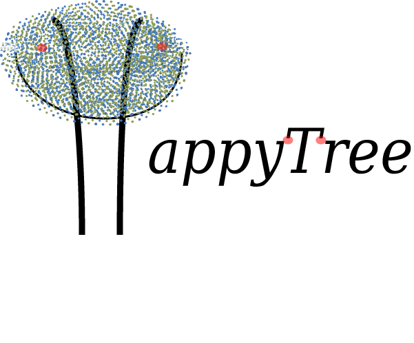

<p align="center">
  <a href="https://happytreeapi.vercel.app/" target="_blank" >
    
  </a>
</p>

“*API designed for handling Java objects with tree-like behavior where each
object behaves similarly to a node within the tree. Add, remove, cut, copy,
print in JSON/XML elements within a tree.*”


<p align="center">
    <a href="LICENSE" target="_blank">
        
    </a>
    <a href="https://github.com/madzera/happytree/actions?query=workflow%3ABuild" target="_blank">
        
    </a>
    <a href="https://sonarcloud.io/dashboard?id=madzera_happytree" target="_blank">
        
    </a>
    <a href="https://sonarcloud.io/dashboard?id=madzera_happytree" target="_blank">
        
    </a>
    <a href="https://sonarcloud.io/dashboard?id=madzera_happytree" target="_blank">
        
    </a>
    <a href="https://sonarcloud.io/dashboard?id=madzera_happytree" target="_blank">
        
    </a>
    <a href="https://github.com/madzera/happytree/releases/tag/v2.0.0" target="_blank">
        
    </a>
</p>

## Disclaimer About the HappyTree API 2.0.0
Compared to the **v1.0.0** the **groupId** of this new version has been changed:

```diff
- <groupId>com.madzera.happytree</groupId>
  <artifactId>happytree</artifactId>
- <version>1.0.0</version>
+ <groupId>com.madzera</groupId>
  <artifactId>happytree</artifactId>
+ <version>2.0.0</version>
```

## About the HappyTree API

### What is it?

HappyTree is a data structure API designed for handling Java objects that have
tree-like behavior, whereas an *@Id* attribute of an object is referenced as a
*@Parent* attribute of its children.

In certain circumstances there is a need to convert a list of Java objects that
could represent a model layer in a business context, into an actual hierarchical
tree structure in memory, where objects contain its children and each child
contains its own children collection and so on.

When there is a need to put a collection (Set/List) of objects, where each
object relates to another object of the same type through an identifier
attribute in a tree-like manner, the HappyTree API is able to transform this
structure into an actual tree structure in memory, where each object will be
wrapped into a tree node object, called *Element*, and each element contains its
children elements, where each child contains its own children and so on
recursively. 

From this point, the API client can handle those elements within a tree, such as
adding/removing children from nodes, moving nodes to another point of the tree
or even to another tree, copying nodes to other trees, converting trees into
JSON/XML, etc.

### What is your purpose?

The HappyTree API aims to provide a way of creating new trees, creating trees
from existing collections of objects that have tree-like behavior, as well as
handling these trees. It provides interfaces for the API client for three
primary and clear objectives:

<ol>
	<li>Handle <b>Java objects</b> as if they were nodes within trees to
		perform operations such as copying, cutting, removing, creating,
		persisting/updating, etc. over those objects.</li>
	<li>Transform linear data structures of <b>Java objects</b> that have
		tree-like behavior into an actual tree.</li>
	<li>Create new trees from scratch.</li>
</ol>

The first purpose represents the basic operations of the trees, when the API
client desires to change the state of the nodes (officially called **Elements**
in the context of the API) in the trees, to move, copy, remove, create and
update those nodes.

The second purpose is suitable for situations in which the API client needs to
transform a collection of plain objects, of which there is a logical tree
relation between them, into an actual tree. Here, each element contains its
child elements, and each child contains its own children recursively.

The last one allows the API client to create new trees from scratch, persisting
element by element to build the tree structure as desired.

### For whom?

For developers who feel the need to handle objects that have a tree-like
behavior in their applications. There are several scenarios in which this API
can be useful, such as:
<ul>
	<li>Handling directory structures.</li>
	<li>Handling organizational structures.</li>
	<li>Handling visual component structures.</li>
	<li>Handling product category structures.</li>
	<li>Handling comment/reply structures.</li>
	<li>And many other scenarios.</li>
</ul>

### When to use?

When the project into which this API was imported has a Java data model
structure that logically represents a tree but its objects are only linearly
referenced to each other, this API has precisely this purpose of transforming
this linear structure into a physical tree structure. This process is known as
the **API Transformation Process**, and it is one of the main core
functionalities of the HappyTree API.

If, for example, the project has a collection of Java model objects representing
directories in a file system, where each directory object has an identifier
attribute which is referenced by the parent attribute from another directory
object in the same collection, then this API can be used to transform this
linear structure into an actual tree structure in memory.

<b>Suppose we have something like this:</b><br>

```java
//Linear tree structure.  
public class Directory {
	//Own ID
	private Integer dirId;
	//Super node reference
	private Integer dirParentId;
	//Simple attribute
	private String dirName;
	
	//getters and setters
}
```

<b>But we want this:</b><br>

```java
//Recursive tree structure wrapped through the Element object.
public interface Element<Directory> {
	private Object dirId;
	private Object dirParentId;
	private Collection<Element<Directory>> subDirs;
	
	//Skeleton methods.
	public void addChild(Element<Directory> child);
	
	public void removeChild(Element<Directory> child);
	
	public void wrap(Directory directory);
	
	public Directory unwrap();
}
```

### How to use?

If you want to do something described above, that is, using the HappyTree API to
transform a linear structure (linear parent-child relationships through the
identifiers) into a tree structure.

#### Code Snippets

1 - You must first add the following annotations to the **Java Class** to which
its objects will be inserted as a tree node:

```java
//Linear tree structure.
@Tree
public class Directory {
	@Id
	private Integer directoryId;
	@Parent
	private Integer directoryParentId;
	//Simple attribute
	private String directoryName;

	public Directory() {}

	public Integer getDirectoryId() {
		return directoryId;
	}

	public void setDirectoryId(Integer directoryId) {
		this.directoryId = directoryId;
	}

	public Integer getDirectoryParentId() {
		return directoryParentId;
	}

	public void setDirectoryParentId(Integer directoryParentId) {
		this.directoryParentId = directoryParentId;
	}

	public String getDirectoryName() {
		return directoryName;
	}

	public void setDirectoryName(String directoryName) {
		this.directoryName = directoryName;
	}
}
```

2 - After that, just group these objects into a collection and initialize a new
session. The meaning of "session" here is a tree instance that will handle these
objects, in other words, sessions are just trees semantically.

A tree can be created either through the **API Transformation Process** of a
previous collection of objects that have tree behavior, disposed in a linear
structure or it can be created freely from scratch, one by one.

For the case of the **API Transformation Process**, the initialization is
something similar to the code below:

```java
	//Getting the collection of Directory objects from a private method.
	Collection<Directory> directories = myObject.myMethodToGetDirectories();

	//API usage to create a tree from the collection above.
	TreeManager manager = HappyTree.createTreeManager();
	TreeTransaction transaction = manager.getTransaction();
	transaction.initializeSession("myFirstHappyTree", directories);
```

To initialize an empty tree from scratch, the code snippet looks something like
the code below:

```java
	TreeManager manager = HappyTree.createTreeManager();
	TreeTransaction transaction = manager.getTransaction();
	transaction.initializeSession("mySecondHappyTree", Directory.class);
```
3 - Now, just handle it as you wish.

```java
	Element<Directory> administration = manager.getElementById(
		administrationId);
	Element<Directory> accessControl = manager.getElementById(
		accessControlId);
	
	/*
	* Access Control menu and its children now will
	* be moved to Administration menu.
	*/
	manager.cut(accessControl, administration);
		
	Directory security = new Directory();
	security.setDirectoryId(securityId);
	security.setDirectoryParentId(administrationId);
		
	Element<Directory> securityElement = manager.createElement(securityId,
		administrationId, security);

	//New inserted element in the tree.		
	manager.persistElement(securityElement);
	
	Element<Directory> root = manager.root();
	System.out.println(root.toJSON());
```

Once created, the trees start to work with
[Element](./src/main/java/com/madzera/happytree/Element.java)
type objects, which will encapsulate (wrap) their respective "original objects"
(Directory) represented as nodes. From there, just use the
[TreeManager](./src/main/java/com/madzera/happytree/TreeManager.java)
interface to handle these elements.

### Documentation

[HappyTree Official Documentation](https://happytreeapi.vercel.app/happytree-2.0.0.pdf)

### Contributing

Would you like to contribute?
We are extremely grateful!
Thank you!

See our [Wiki](https://github.com/madzera/happytree/wiki) or
[Contributing](CONTRIBUTING.md) file.